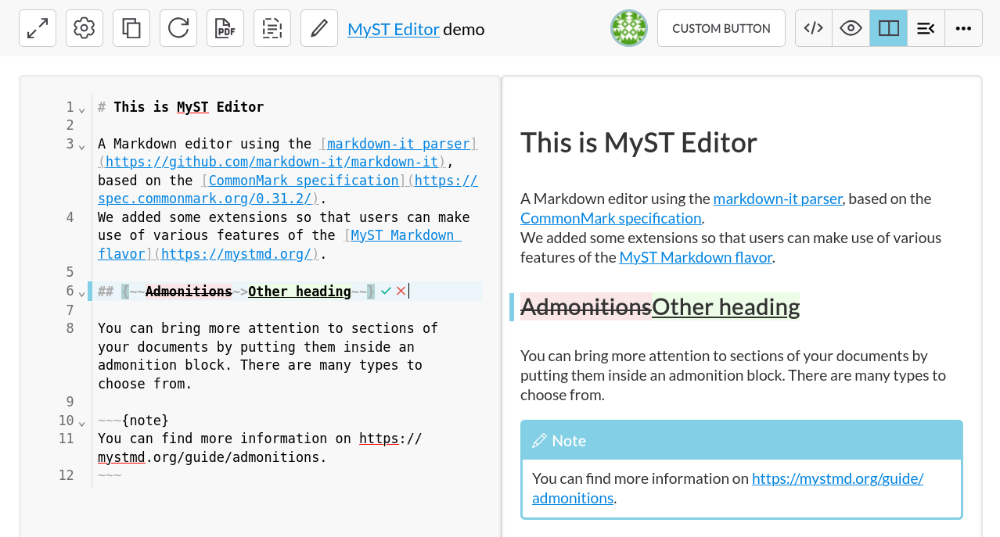

# Comments

Sometimes you want leave some feedback meant for other people editing the document, without changing the document text itself. This is where comments are handy.

## Adding a Comment


To add a comment hover your cursor over the editor gutter (to the left of line numbers) on the line you want to comment on.
This should make the comment icon appear and clicking it will create a comment.

## Toggling Comments

Clicking on the comment icon can be used to hide/show a comment. By default when you load up a document, all preexisting comments will be expanded as well as any new comment which someone adds.

## Collaborating on a Comment


Comments can be multiple lines long and multiple people can participate in writing one comment. Instead of something like comment threads, MyST Editor has a concept of line authorship.
Every line of a comment is colored by the author of that line. If you hover over a line, you can also see its authors avatar to the left of the comment.
If you want to participate in a discussion, it is recommended to add a new line (for example at the end of a comment).

## Moving Comments

As new lines are added above a line with a comment, the comment will move with its original line. Pressing enter at the beginning of a commented line will also move it downwards.

```{warning}
Pressing backspace at the beginning of a commented line will delete the comment.
```

You can also move comments via drag and drop. To move a comment to another line, drag its icon to the left of another lines line number.

```{tip}
Moving a comment onto another comment, will append its contents.
```

## Deleting Comments

```{warning}
Deleting a comment will delete parts of a comment from all users, not just your text. Please be cautious.
```

In order to delete a comment you can:

- press backspace at the beginning of a commented line
- delete/cut a selection containing the commented line
- hover over the comment icon and press the delete button
- press the delete button in the resolved comments view (details in the next section)

## Resolving Comments

MyST Editor offers a comment resolving functionality similar to the one you might be familiar with on for eg. a Gitlab merge request.
If you want to get rid of a comment because the discussion around it is finished and you don't want it polluting the editor, you can resolve it.
This will move it to the Resolved Comments view in the topbar and keep it for later just in case. To resolve a comment, hover over its icon and click the resolve button.
Click the Resolved Comments button to see it. Such comments keep some information with them:

- the user who started the comment
- the user who resolved a comment
- when was the comment resolved
- which line did the comment belong to

You can access some more options by hovering over the `...` button in the top right of a comment.


### Restoring Comments

After a comment is resolved, it tries to keep track of the line it was attached to. If the text of the line or its line number change, this will be reflected in this view.
You can bring back a comment to the editor by clicking the restore button in the `...` menu.

```{important}
If there is currently a comment on the line a resolved comment was attached to, when opening the menu the restore button will say `RESTORE AND MERGE`.
This means the original line is occupied. If you press this button, the resolved comment will be added to the bottom of the comment already on that line.


```

#### Orphaned Comments


If a resolved comment does not have a line number next to it, or the text of the commented line is crossed out the line the comment was assigned to has been deleted.
Such a comment is considered `orphaned`. If you try to restore such a comment, it will be added to the last line of the document. From there you can of course move it wherever you want.

```{warning}
Applying a document template to a document with resolved comments, will make all of them orphaned.
```

## Suggestions



You can suggest changes to a line in a comment. To do so you can use the following syntax somewhere in the comment:

```md
|<text to replace> -> <replacement>|
eg. |is -> was|
```

This will cross out all the occurrences of such text and place a suggested replacement next to them in the document.
The suggestion will be colored after the color of the comment line it is on.
Clicking the colored suggestion will apply it, this can be undone/redone. This will only apply one occurrence of the suggestion.

```{note}
Suggestions only match against whole words/symbols. If you want to match a certain occurrence of a word, try adding more context (more words/symbols around it).
```

````{tip}
If you don't specify a replacement, the text between `||` will be highlighted. This can be useful to bring attention to a section of a line.

```md
eg. |something| - this will highlight the word something
```
````
